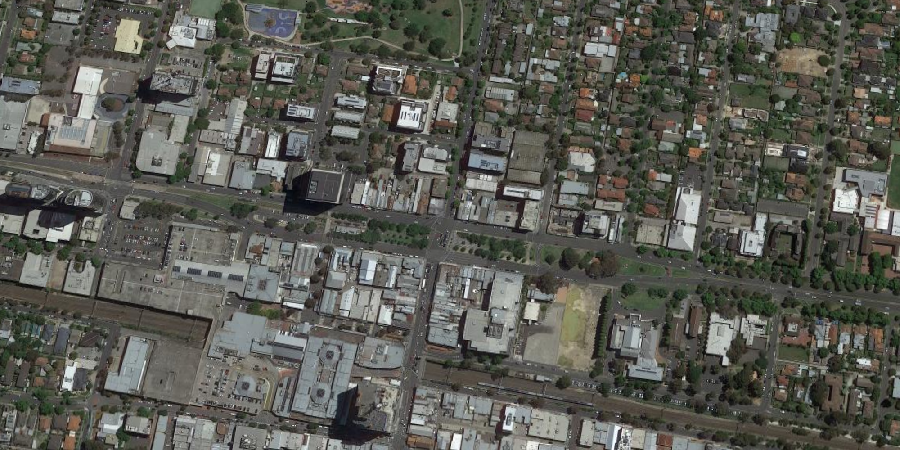
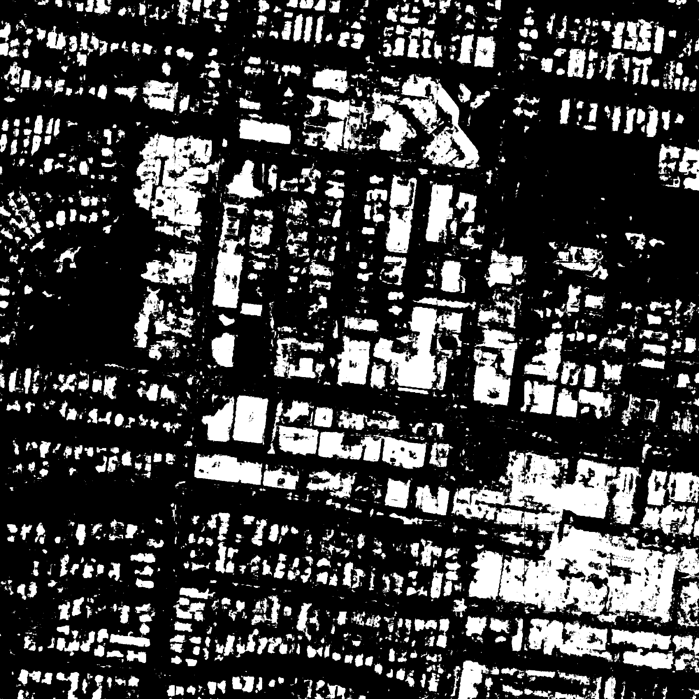

# Aerial Image Segmentation with PyTorch (2021-Jan)

This repository is based on the original [repository (2018)](https://github.com/romanroibu/aerial-image-segmentation) by Roman Roibu. Improvements and Changes have been made due to the rapid development in deep learning community. 

The UNet leads to more advanced design in Aerial Image Segmentation. Future updates will gradually apply those method into this repository. 



### Prerequisites

- [`Anaconda`](https://www.anaconda.com/products/individual): Your data science toolkit. 
- [`mini-conda`](https://docs.conda.io/en/latest/miniconda.html): a free minimal installer for conda. It is a small, bootstrap version of Anaconda that includes only conda,  


### Setup

Create a new virtual environment to install the required libraries, use 'conda' or 'pyenv'

### Python Packages
- numpy==1.19.2
- matplotlib==3.3.2
- pillow==8.10
- pytorch==1.7.1
- torchvision==0.8.2
- tqdm==4.51.0
## Train (Deep) ConvNets - U-Nets

```
$ python train.py
```

#### Output

```
Epoch  1/200: 100%|██████████████████████| 223/223 [01:53<00:00,  1.96it/s, loss=0.653383]
Epoch  2/200: 100%|██████████████████████| 223/223 [01:47<00:00,  2.07it/s, loss=0.461838]
Epoch  3/200: 100%|██████████████████████| 223/223 [01:53<00:00,  1.97it/s, loss=0.445231]
... ... 
(i) Model saved at ./weights/model.pt
(i) Loss plot saved at ./images/output/loss_plot.png
```


## Predict (Training Validation)
Use the training data as input to test the model.
```
$ python predict.py
```
#### Output

```
(i) Prediction and Mask image saved at ./images/output/prediction.png
(ii) Prediction and Mask image saved at ./images/output/mask.png
```

**Prediction with mask**:


**Binary with mask**:
This is an binary mask, you can see there are extra works needed to improve the restuls. The improments can be from the `Deep Learning model` or the `Image Postprocessing method`.  



### Reference
- Encoder-Decoder with Atrous Separable Convolution for Semantic Image Segmentation, Liang-Chieh Chen, Yukun Zhu, George Papandreou, Florian Schroff, and Hartwig Adam, arXiv: 1802.02611, 2018.
- Xception: Deep Learning with Depthwise Separable Convolutions, François Chollet, Proc. of CVPR, 2017.
- Deformable Convolutional Networks — COCO Detection and Segmentation Challenge 2017 Entry, Haozhi Qi, Zheng Zhang, Bin Xiao, Han Hu, Bowen Cheng, Yichen Wei, and Jifeng Dai, ICCV COCO Challenge Workshop, 2017.
- Semantic Image Segmentation with Deep Convolutional Nets and Fully Connected CRFs, Liang-Chieh Chen, George Papandreou, Iasonas Kokkinos, Kevin Murphy, and Alan L. Yuille, Proc. of ICLR, 2015.
- Deeplab: Semantic Image Segmentation with Deep Convolutional Nets, Atrous Convolution, and Fully Connected CRFs, Liang-Chieh Chen, George Papandreou, Iasonas Kokkinos, Kevin Murphy, and Alan L. Yuille, TPAMI, 2017.
- Rethinking Atrous Convolution for Semantic Image Segmentation, Liang-Chieh Chen, George Papandreou, Florian Schroff, and Hartwig Adam, arXiv:1706.05587, 2017.


### --END--