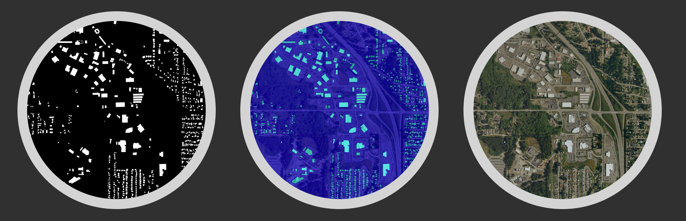
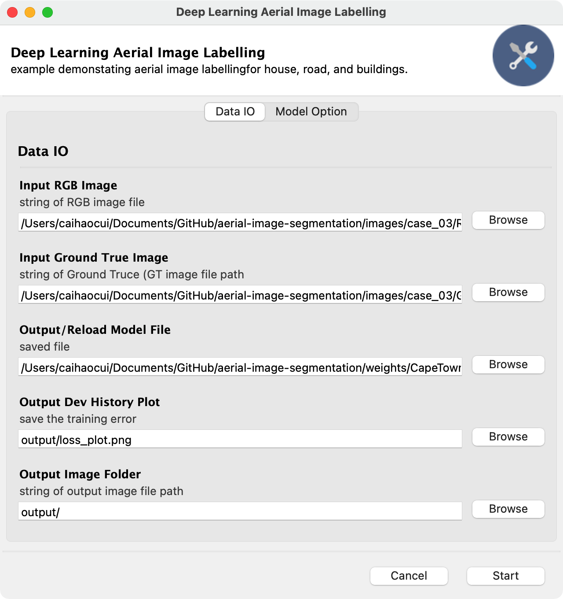
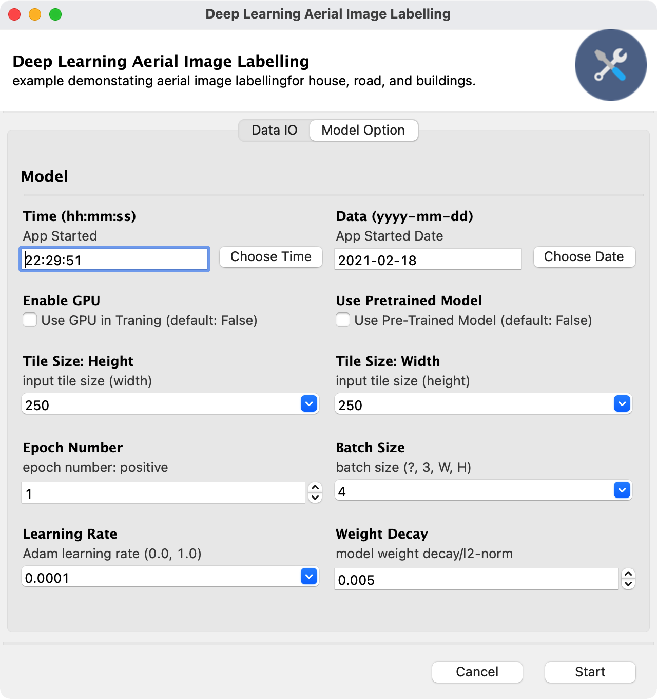
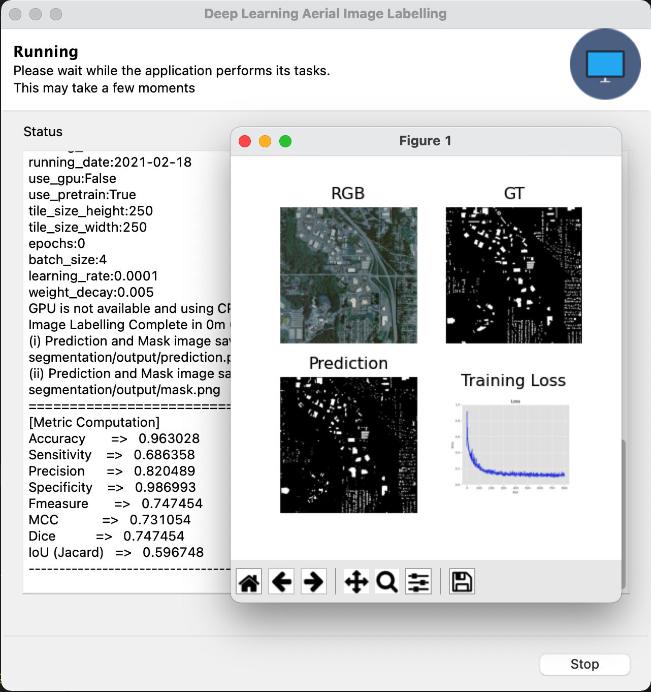
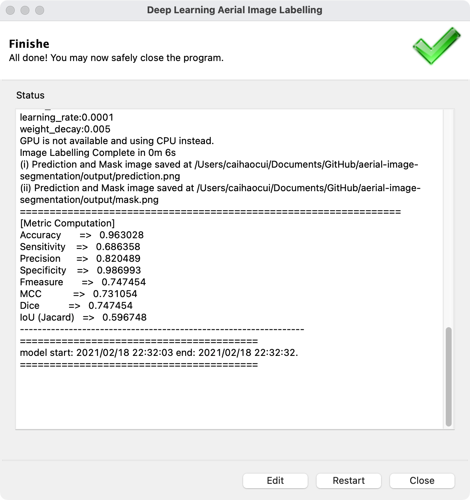
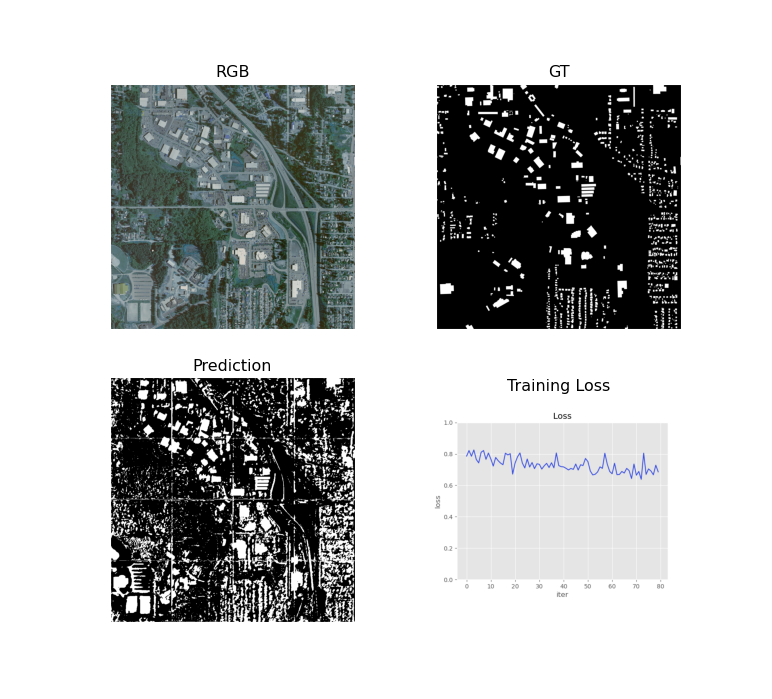
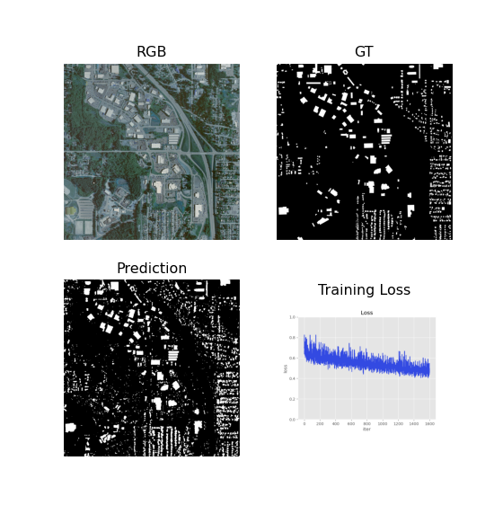
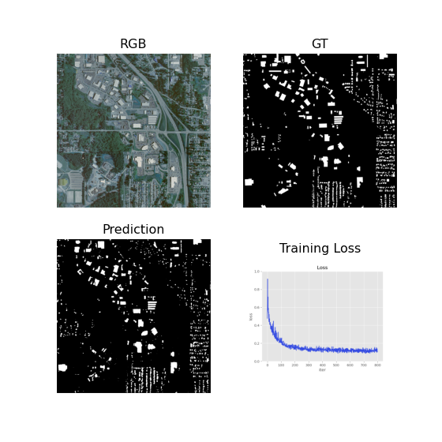
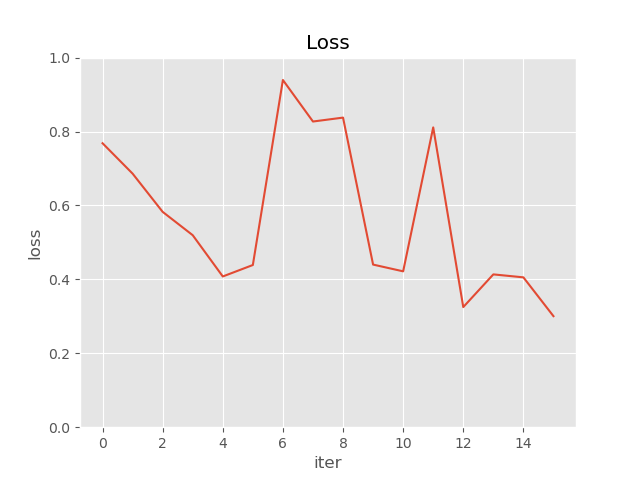

# Aerial Image Segmentation with PyTorch (2021 v1.7.1)

Aerial Image Labeling addresses a core topic in remote sensing: the automatic pixel-wise labelling of aerial imagery. The UNet leads to more advanced design in Aerial Image Segmentation. Future updates will gradually apply those methods into this repository.

This repo used only one sample (`kitsap11.tif `) from the public dataset ([Inria Aerial Image Labelling ](https://project.inria.fr/aerialimagelabeling/leaderboard/)) to demonstrate the power of deep learning.

Data processing steps and codes can be find in this [file]("images/image_data.md"). The original sample has been preprocessed into 1000x1000 with 1.5 meter resolution.



### Prerequisites

- [`Anaconda`](https://www.anaconda.com/products/individual): Your data science toolkit.
- [`mini-conda`](https://docs.conda.io/en/latest/miniconda.html): a free minimal installer for conda. It is a small, bootstrap version of Anaconda that includes only conda,

### Python Package Setup

Create a new virtual environment to install the required libraries, use 'conda' or 'pyenv'
with the following Python Packages:

- numpy==1.19.2
- matplotlib==3.3.2
- pillow==8.10
- pytorch==1.7.1
- torchsummary==1.5.1
- torchvision==0.8.2
- tqdm==4.51.0
- opencv-python==4.5.1

## Deep Learning for Aerial Image Labelling GUI

You can start the App with GUI with the following command:

```python
python app_gui.py
# or pythonw GUI_DL_AIM.py # on MacOS
```

### Step 1: select the image and file paths.



### Step 2: setup model configurations / click Start



### Step 3: wait for the results or Stop the program



### Step 4: Edit (Data IO/Model Options) and Restart or Close the Program



The GUI is designed with respect to the original python `argparse` setting with Gooey Packages.

- Data IO: input and output file and paths.
- Model Options: Time, Date, GPU, Pretrained model, Epochs, Batch Size, Learning Rate, Regularization.
- Cancel/ Start Button to Execute the program.

Notification: When Epochs Number is 0, it will load the pre-trained model to predict the masks only without training.

### Suggestion: Use GPU and CUDA 11

I test this repo with my XPS 15 Intel-i7-CPU with GPU-1050TI-maxQ-4GB-RAM & CUDA 11. ** It is fair to say GPU is at least 10 times faster than the CPU.**

Here are the training experimental Records on the sample image pair:

| Metric         | 5 Epochs | 100 Epochs | 200 Epochs |
| -------------- | -------- | ---------- | ---------- |
| # Accuracy     | 0.801270 | 0.937253   | 0.963028   |
| # Sensitivity  | 0.811900 | 0.860760   | 0.686358   |
| # Precision    | 0.260489 | 0.570543   | 0.820489   |
| # Specificity  | 0.800349 | 0.943879   | 0.986993   |
| # Fmeasure     | 0.394429 | 0.686229   | 0.747454   |
| # MCC          | 0.383756 | 0.670022   | 0.731054   |
| # Dice         | 0.394429 | 0.686229   | 0.747454   |
| # IoU (Jacard) | 0.245663 | 0.522335   | 0.596748   |





## Train (Deep) ConvNets - U-Nets with new data

```bash
$ python train.py --epoch 1 # 1 (default) or 200
```

or add arguments for different model inference configurations.

```bash
$ python train.py -h

usage: AIL: Aerial Image Labelling [options]

Aerial Image Labelling with Deep Learning.

optional arguments:
  -h, --help            show this help message and exit
  --input_RGB Input RGB Images:
                        string of RGB image file path
  --input_GT INPUT_GT   string of Ground Truce (GT image file path
  --output_model_path OUTPUT_MODEL_PATH
  --output_loss_plot OUTPUT_LOSS_PLOT
  --output_images OUTPUT_IMAGES
                        string of output image file path
  --version, -v         show program's version number and exit
  --use_gpu USE_GPU     Use GPU in Traning the Model (default: False)
  --use_pretrain USE_PRETRAIN
                        Use Pre-Trained ConvNets in Traning the Model (default: True)
  --tile_size TILE_SIZE TILE_SIZE
                        input tile size
  --epochs EPOCHS       epoch number
  --batch_size BATCH_SIZE
                        batch size (?, channel, width, height)
  --learning_rate LEARNING_RATE
                        model training learning rate
  --weight_decay WEIGHT_DECAY
                        model weight decay / l2 regularization

And that's how AI can help
```

Output

```
Epoch  1/200: 100%|██████████████████████| 223/223 [01:53<00:00,  1.96it/s, loss=0.653383]
Epoch  2/200: 100%|██████████████████████| 223/223 [01:47<00:00,  2.07it/s, loss=0.461838]
Epoch  3/200: 100%|██████████████████████| 223/223 [01:53<00:00,  1.97it/s, loss=0.445231]
... ...
(i) Model saved at ./weights/model.pt
(i) Loss plot saved at ./images/output/loss_plot.png
```



## Predict (Training Validation)

Use the training data as input to test the model.

```bash
$ python predict.py
# python predict.py -h
```

Output

```bash
(base) ➜  aerial-image-segmentation git:(master) ✗ python predict.py
GPU is not available and using CPU instead.
use pre-trained model!
Image Labelling Complete in 0m 6s
(i)    Prediction and Mask image saved at output//prediction.png
(ii)   Mask image saved at output//mask.png
================================================================
[Metric Computation]
Accuracy       =>   0.963028
Sensitivity    =>   0.686358
Precision      =>   0.820489
Specificity    =>   0.986993
Fmeasure       =>   0.747454
MCC            =>   0.731054
Dice           =>   0.747454
IoU (Jacard)   =>   0.596748
----------------------------------------------------------------
model start: 22:16:56 end: 22:17:03.
```

**RGB, GT, Mask, Prediction**:


**Binary with mask**:

This is a binary mask, you can see there are extra works needed to improve the results. The improments can be from the `Deep Learning model` or the `Image Postprocessing method`.

### Reference

- Encoder-Decoder with Atrous Separable Convolution for Semantic Image Segmentation, Liang-Chieh Chen, Yukun Zhu, George Papandreou, Florian Schroff, and Hartwig Adam, arXiv: 1802.02611, 2018.
- Xception: Deep Learning with Depthwise Separable Convolutions, François Chollet, Proc. of CVPR, 2017.
- Deformable Convolutional Networks — COCO Detection and Segmentation Challenge 2017 Entry, Haozhi Qi, Zheng Zhang, Bin Xiao, Han Hu, Bowen Cheng, Yichen Wei, and Jifeng Dai, ICCV COCO Challenge Workshop, 2017.
- Semantic Image Segmentation with Deep Convolutional Nets and Fully Connected CRFs, Liang-Chieh Chen, George Papandreou, Iasonas Kokkinos, Kevin Murphy, and Alan L. Yuille, Proc. of ICLR, 2015.
- Deeplab: Semantic Image Segmentation with Deep Convolutional Nets, Atrous Convolution, and Fully Connected CRFs, Liang-Chieh Chen, George Papandreou, Iasonas Kokkinos, Kevin Murphy, and Alan L. Yuille, TPAMI, 2017.
- Rethinking Atrous Convolution for Semantic Image Segmentation, Liang-Chieh Chen, George Papandreou, Florian Schroff, and Hartwig Adam, arXiv:1706.05587, 2017.

## Acknowledgement

This repository is based on the original [repository](https://github.com/romanroibu/aerial-image-segmentation) by Roman Roibu.
Improvements and changes have been made due to the rapid development in deep learning community.

### --END--
