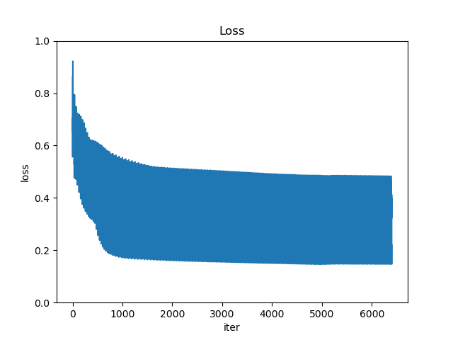

# Aerial Image Segmentation

### Prerequisites

- [`pyenv`](https://github.com/pyenv/pyenv)
- [`pyenv-virtualenv`](https://github.com/pyenv/pyenv-virtualenv)

### Setup

Create a new virtual environment to install the required libraries:
```bash
$ pyenv virtualenv 3.6.5 aerial-segmentation-challenge
$ pyenv activate aerial-segmentation-challenge
```

Install the requirements with `pip`:
```bash
$ pip install --upgrade pip
$ pip install -r requirements.txt
```

## Train

```
$ python train.py
```

#### Output

```
Epoch  1/10: 100%|██████████████████████| 223/223 [01:53<00:00,  1.96it/s, loss=0.653383]
Epoch  2/10: 100%|██████████████████████| 223/223 [01:47<00:00,  2.07it/s, loss=0.461838]
Epoch  3/10: 100%|██████████████████████| 223/223 [01:53<00:00,  1.97it/s, loss=0.445231]
Epoch  4/10: 100%|██████████████████████| 223/223 [01:40<00:00,  2.22it/s, loss=0.432687]
Epoch  5/10: 100%|██████████████████████| 223/223 [01:39<00:00,  2.25it/s, loss=0.417365]
Epoch  6/10: 100%|██████████████████████| 223/223 [01:45<00:00,  2.11it/s, loss=0.410496]
Epoch  7/10: 100%|██████████████████████| 223/223 [01:40<00:00,  2.22it/s, loss=0.412155]
Epoch  8/10: 100%|██████████████████████| 223/223 [01:37<00:00,  2.29it/s, loss=0.401274]
Epoch  9/10: 100%|██████████████████████| 223/223 [01:36<00:00,  2.32it/s, loss=0.391534]
Epoch 10/10: 100%|██████████████████████| 223/223 [01:34<00:00,  2.35it/s, loss=0.386598]
(i) Model saved at ./weights/model.pt
(i) Loss plot saved at ./images/output/loss_plot.png
```



## Predict

```
$ python predict.py
```

#### Output

```
(i) Prediction image saved at ./images/output/prediction.png
```


